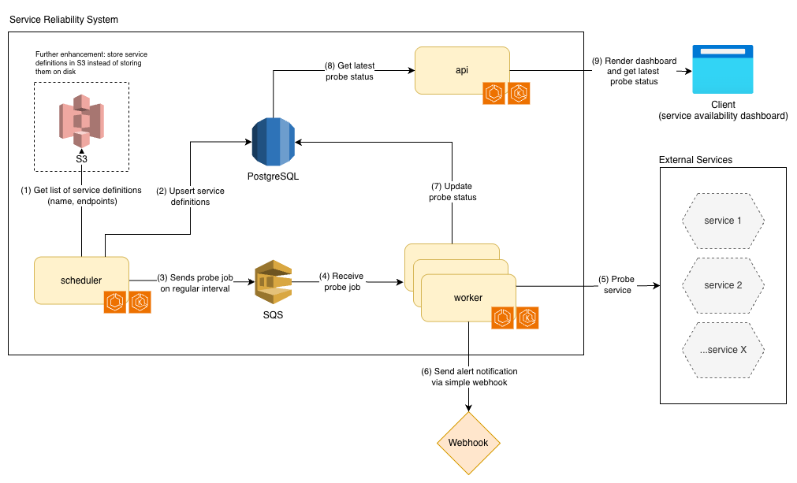
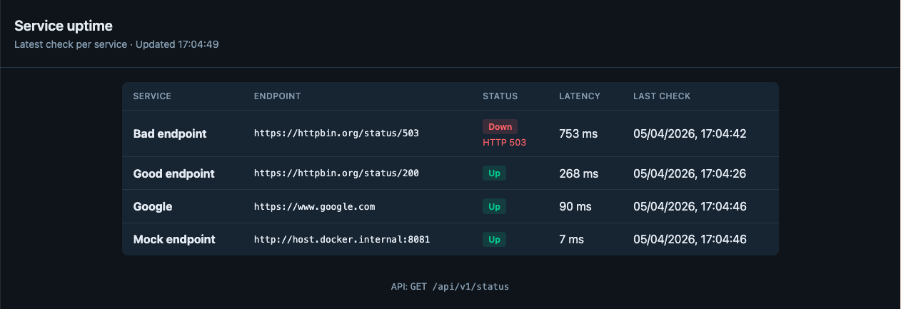
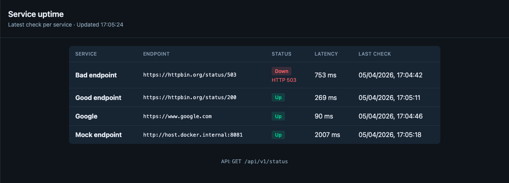
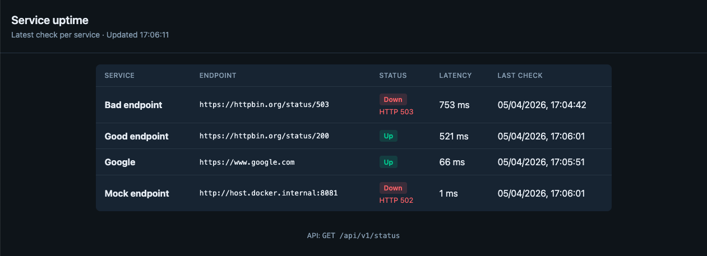
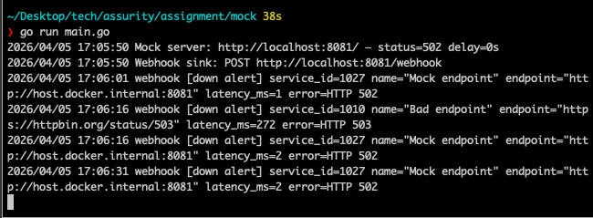

# Uptime availability checker

Periodically probes HTTP endpoints, stores results in PostgreSQL, exposes status via a small API and dashboard, and optionally alerts on downtime via webhook.


## Quickstart

### Prerequisites

- **Docker** with **Docker Compose** v2 (`docker compose`, not only `docker-compose`)

### Run everything locally

1. Clone this repository and open a terminal in the project root.

2. Start the stack (builds images and starts API, scheduler, worker, Postgres, LocalStack):

   ```bash
   docker compose up --build
   ```

3. Wait until containers are healthy (first run can take **1–2 minutes** while Postgres and LocalStack become ready).

4. Open the app:

   | What | URL |
   |------|-----|
   | **Dashboard** | [http://localhost:8080](http://localhost:8080) |
   | **JSON API** | [http://localhost:8080/api/v1/status](http://localhost:8080/api/v1/status) |

5. **Optional — check the API from the shell:**

   ```bash
   curl -s http://localhost:8080/api/v1/status | head
   ```

### Optional — mock server for probe target and webhook

You can optionally start a small helper in a **second terminal** to play around with the availability checker:

```bash
go run ./mock
```

This listens on **port 8081**: **`/`** is a fake HTTP endpoint the worker can probe, and **`POST /webhook`** prints JSON alert payloads to the console. In `mock/main.go` you can switch the response to **503** and tune artificial **latency** to simulate failures and slow responses.

### How to add a new service to monitor

- Edit **`config/services.yaml`** (each service needs a unique `name` and an `endpoint` URL).
- The scheduler mounts `./config` read-only; **you do not need to rebuild** the image for YAML-only changes. Updates are picked up on the next **`SCHEDULER_TICK`** (default **5s**), or restart the scheduler: `docker compose restart scheduler`.

## Design Overview



### Runtime flow

1. **Scheduling** — The scheduler loads config on each tick, selects services that are due, and sends **one SQS message per service** (`ProbeJob` with `service_id`).
3. **Execution** — Workers long-poll SQS, gets the service definition from the DB, **HTTP GET** the endpoint (with timeout and retries), insert into `probe_results`, optionally **POST** to `ALERT_WEBHOOK_URL` on **down**, then **delete** the message. Failed handling relies on the visibility timeout for retries (**at-least-once** delivery).
4. **Dashboarding** — The API serves the latest result per service on the dashboard and `GET /api/v1/status`.

### Components

| Part | Responsibility |
|------|----------------|
| **Scheduler** | Load `config/services.yaml`, upsert services, enqueue due jobs to SQS. |
| **Worker** | Consume jobs, run the HTTP probe, persist results, optional webhook, ack by deleting the message. |
| **API** | Expose JSON status and the HTML dashboard. |
| **PostgreSQL** | Services table + `probe_results` history. |
| **SQS** | Buffer between scheduler and workers (LocalStack in Docker Compose). |

### Code layout (hexagonal)

`internal/domain` and `internal/application` hold behavior and **ports**; `internal/adapters` implement Postgres, SQS, YAML, HTTP probe, and webhook; `cmd/*` is the composition root. That keeps core logic testable and swappable (e.g. AWS vs LocalStack).

| Layer | Package | Role |
|-------|---------|------|
| **Domain** | `internal/domain` | Entities (`ServiceDefinition`, `ProbeResult`, `ProbeJob`). **Ports:** `ServiceRepository`, `JobQueue`, `AvailabilityProbe`, `ServiceLoader`, `DownNotifier`, `LatestStatusReader`. |
| **Application** | `internal/application` | `SchedulerService`, `WorkerService`, `StatusService`. |
| **Adapters** | `internal/adapters/...` | YAML loader; Postgres, SQS, HTTP probe, webhook. |
| **Composition** | `cmd/*` | Wire concrete adapters. |

### `config/services.yaml`

Each service needs a unique `name` and an HTTP(S) `endpoint`.

| Field | Meaning | Default |
|-------|---------|---------|
| `interval` | Minimum time between enqueueing checks (Go duration, e.g. `30s`, `1m`) | `30s` |
| `timeout` | Per-request HTTP timeout for each attempt | `15s` |
| `retries` | **Extra** HTTP attempts after the first failure (`0`–`20`) | `0` |

The scheduler persists these fields and only enqueues when `interval` has elapsed since `last_enqueued_at`.

### Trade-offs

| Decision | Benefit | Cost |
|----------|---------|------|
| **SQS between scheduler and workers** | Scale workers independently; buffer spikes; retries via visibility timeout | **At-least-once** delivery — duplicates possible; re-probing the same service must be acceptable. |
| **YAML on disk (`CONFIG_PATH`)** | Simple, Git-reviewable | No self-serve UI; production must supply the file (mount, EFS, init fetch, etc.). |
| **`SCHEDULER_TICK` loop** | Easy to implement and reason about | Not sub-second scheduling precision. |
| **Webhook on every down** | Small surface area, generic HTTP integration | Can be noisy; no “only on transition” or cooldown in v1. |
| **Postgres for catalog + history** | One database, relational queries | High-volume history may need retention or archival later. |
| **Embedded HTML dashboard** | No front-end build | Basic UX vs a full SPA. |

## Infrastructure/Deployment

### Infrastructure

The scheduler, worker, and API are packaged as separate Docker images and deployed on Kubernetes (EKS) to enable independent scaling, rolling updates, and automatic recovery from failures. Images are stored in ECR and infrastructure can be provisioned using Terraform or CloudFormation.

PostgreSQL runs on Amazon RDS (Multi-AZ) for durability and managed backups. SQS decouples the scheduler from workers and smooths traffic spikes. Service definitions can be stored in PostgreSQL initially and optionally moved to S3 later for simpler configuration management.

Services run in private subnets, with the API exposed via an Application Load Balancer. IAM roles and Secrets Manager handle credentials securely. Liveness and readiness probes ensure service health within the cluster.

### Monitoring

Infrastructure metrics (CPU, memory, pod restarts, SQS depth, API latency, DB connections) are collected via Prometheus + Grafana.

Business metrics include probe success rate, probe latency, worker throughput, and failure counts. Structured logs are centralized in Grafana as well.

Alerting is configured for probe failures above thresholds, queue/DLQ backlog growth, API errors, and database health issues.

## Screenshots

### Mock endpoint with `Up` status



### Mock endpoint with `Up` status and high latency



### Mock endpoint with `Down` status



### Alerts triggered on webhook


